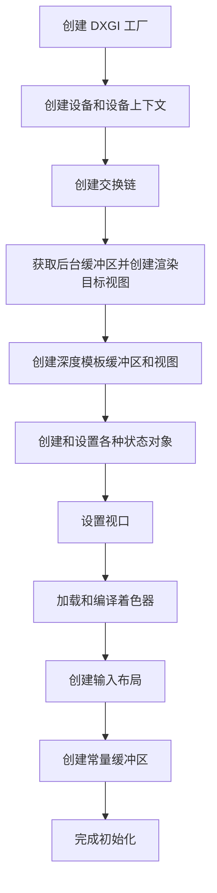

# DirectX 11 渲染初始化流程笔记

## DirectX 11 渲染初始化流程概述

DirectX 11 渲染管线初始化是一个复杂的过程，需要依次创建多个组件。以下是主要步骤和各组件的作用：

## 1. DXGI 工厂 (IDXGIFactory)

### 初始化目的
- 用于创建设备和交换链
- 枚举适配器和显示器

### 主要作用
- 管理适配器（GPU）和交换链
- 提供对硬件抽象层的访问

## 2. 设备 (ID3D11Device) 和设备上下文 (ID3D11DeviceContext)

### 初始化目的
- 创建渲染设备和上下文
- 管理资源和执行渲染命令

### 主要作用
- 设备：用于创建资源（纹理、缓冲区、着色器等）
- 上下文：用于提交渲染命令和管理状态

## 3. 交换链 (IDXGISwapChain)

### 初始化目的
- 管理前后缓冲区
- 实现页面翻转以防止撕裂

### 主要作用
- 在后台渲染到一个缓冲区的同时显示另一个缓冲区的内容
- 支持垂直同步（VSync）以防止屏幕撕裂

## 4. 渲染目标视图 (ID3D11RenderTargetView)

### 初始化目的
- 将交换链的后台缓冲区绑定为渲染目标

### 主要作用
- 定义如何使用纹理作为渲染目标
- 指定渲染输出的目标位置

## 5. 深度模板缓冲区 (ID3D11Texture2D)

### 初始化目的
- 创建深度和模板缓冲区纹理

### 主要作用
- 存储深度信息，用于隐藏面消除
- 存储模板信息，用于遮罩效果

## 6. 深度模板视图 (ID3D11DepthStencilView)

### 初始化目的
- 将深度模板缓冲区绑定为深度/模板目标

### 主要作用
- 定义如何使用纹理作为深度/模板缓冲区
- 控制深度测试和模板测试

## 7. 深度模板状态 (ID3D11DepthStencilState)

### 初始化目的
- 定义深度和模板测试的行为

### 主要作用
- 控制深度测试的启用/禁用
- 设置深度比较函数
- 控制模板测试和模板操作

## 8. 光栅化状态 (ID3D11RasterizerState)

### 初始化目的
- 定义光栅化阶段的行为

### 主要作用
- 控制多边形填充模式（实心/线框）
- 设置剔除模式（正面/背面/无）
- 设置深度剪裁

## 9. 视口 (D3D11_VIEWPORT)

### 初始化目的
- 定义从规范化设备坐标到屏幕坐标的映射

### 主要作用
- 指定渲染区域的大小和位置
- 定义深度范围

## 10. 着色器 (顶点着色器、像素着色器等)

### 初始化目的
- 编译和创建着色器程序

### 主要作用
- 顶点着色器：处理顶点变换和光照
- 像素着色器：计算片段颜色
- 几何着色器：处理整个图元
- 计算着色器：通用计算任务

## 11. 输入布局 (ID3D11InputLayout)

### 初始化目的
- 定义顶点数据的格式

### 主要作用
- 描述顶点缓冲区中数据的组织方式
- 将顶点数据映射到顶点着色器输入

## 12. 常量缓冲区 (ID3D11Buffer)

### 初始化目的
- 创建用于传输着色器常量的数据缓冲区

### 主要作用
- 存储变换矩阵、材质属性等常量数据
- 从 CPU 向 GPU 传递数据

## 初始化流程总结

## 关键概念

- **设备 (Device)**: 用于创建资源
- **上下文 (Context)**: 用于执行命令
- **交换链 (Swap Chain)**: 管理前后缓冲区
- **视图 (View)**: 定义如何访问资源
- **状态对象 (State Objects)**: 定义渲染管线行为
- **着色器 (Shaders)**: 定义渲染逻辑