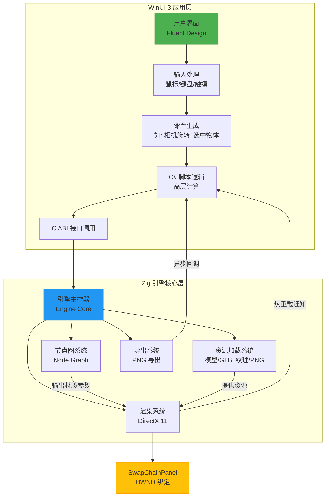

# 项目规划（Zig 引擎 + WinUI 3 绑定）

## 一、整体架构原则

- **引擎为黑盒**：Zig 引擎仅通过 C ABI 对外暴露最小接口，不暴露任何内部结构、内存布局或类型定义。
- **单向控制流**：C# → Zig 为主（命令/查询），Zig → C# 为辅（异步回调通知）。
- **资源生命周期**：由引擎全权管理，C# 只持有不透明句柄（`void*`），通过显式调用释放。
- **零运行时依赖**：引擎不依赖 libc++、STL 或 .NET，仅使用 Windows SDK（DirectX）和可选的 C 兼容库（如 stb_image）。

## 二、Zig 引擎核心模块与功能

### 1. 引擎主控器（Engine Core）

- **职责**：负责全局状态管理（模型池、节点图实例、渲染上下文、回调注册表）。
- **生命周期**：提供 `engine_create` 和 `engine_destroy` 接口。
- **内存管理**：使用 `std.heap.c_allocator` 作为默认分配器，确保与 C# 互操作的兼容性。
- **错误处理**：内部使用 Zig 的 error union 类型进行安全错误传播，对外统一转换为 `bool` 或 `int` 返回码以保持 C ABI 兼容。
- **线程模型**：引擎内部采用单线程设计（主线程），所有 API 调用需从同一 OS 线程发起，避免并发问题。

### 2. 资源加载系统（Resource Loader）

- **模型支持**：通过集成 [cgltf](https://github.com/jkuhlmann/cgltf) 库解析 `.glb`/.gltf 文件，轻量且易于嵌入。
- **纹理支持**：使用 [stb_image](https://github.com/nothings/stb) 加载 PNG/JPG 等常见格式。
- **加载方式**：当前为同步阻塞式加载，适用于启动时资源预加载；未来可通过工作线程+消息队列实现异步加载。
- **资源标识**：所有资源在引擎内部生成唯一 `u64` ID，C# 层通过不透明句柄（`void*`）引用。
- **编译期检查**：利用 `comptime` 在 Zig 编译阶段验证资源路径是否存在，提升开发体验（仅开发构建启用）。
- **内存策略**：资源数据在 GPU 显存中持久驻留，由引擎在 `unload_*` 调用或引擎销毁时统一释放。
### 3. 节点图系统（Node Graph）

- **节点标识**：使用字符串名称（如 `"pbr"`, `"noise"`）而非枚举，便于动态扩展和自定义节点类型。
- **参数传递**：C# 层将 UI 表单数据序列化为 JSON 字符串，通过 `update_node_params(node_handle, json_params)` 接口传入引擎，Zig 使用 [Ziggy](https://github.com/mitchellh/ziggy) 或手写解析器处理。
- **连接机制**：通过 `(src_node_id, src_slot, dst_node_id, dst_slot)` 四元组描述连接关系，由 `connect_nodes()` API 管理。
- **图求值**：在 CPU 上执行拓扑排序后逐节点计算，输出标准化的材质参数（PBR 参数）或生成 HLSL 代码片段（程序化材质）。
- **动态逻辑**：不内置脚本解释器；复杂逻辑由 C# 脚本计算后，将结果作为参数注入节点图。
- **内存管理**：节点图数据结构在引擎堆上分配，生命周期由 `create_graph` / `destroy_graph` 控制。

### 4. 渲染系统（Renderer）

- **图形 API**：基于 DirectX 11，利用 Windows 原生支持，无需额外运行时安装。
- **渲染模式**：
  - **实时预览**：引擎绑定至 WinUI 3 `SwapChainPanel` 的 `HWND`，由 C# 主循环驱动每帧调用 `render_frame()`。
  - **离屏渲染**：创建独立的 `ID3D11Texture2D` 作为 Render Target，用于高质量截图或批量导出。
- **材质驱动**：节点图的输出结果动态填充 Constant Buffer 或更新纹理资源，实现可视化编程控制材质。
- **Shader 管理**：
  - 编译：启动时或运行时通过 D3DCompile API 编译 HLSL。
  - 热重载：使用 `ReadDirectoryChangesW` 监听着色器文件变化，自动重新编译并更新 PS/VS Shader 对象。
- **资源安全**：广泛使用 `defer` 和 `errdefer` 确保 `ID3D11Device`、`ID3D11Buffer` 等 COM 资源在任何退出路径下都能被正确 `Release()`。
### 5. 导出系统（Exporter）

- **流程**：触发离屏渲染 → 使用 `ID3D11DeviceContext::CopyResource` 将 Render Target 复制到 staging texture → `Map()` 读取 CPU 可访问的像素数据（RGBA8）。
- **图像编码**：集成 [stb_image_write](https://github.com/nothings/stb) 库，将原始像素数据编码为 PNG 格式。
- **文件写入**：导出路径由 C# 通过 UTF-8 编码字符串提供，引擎调用 Windows API（如 `CreateFileW`, `WriteFile`）完成写入。
- **异步支持**：导出操作可在独立线程执行，避免阻塞主渲染线程，完成后通过回调通知 C#。

## 三、与 WinUI 3 的交互设计

### 1. 交互边界：C ABI 接口（glue.h）

接口设计遵循以下规则：

- 所有对象通过不透明句柄（`void*`）传递；
- 输入字符串为 null-terminated UTF-8 `const char*`；
- 输出数据通过指针参数返回（如 `ModelHandle* out_model`）；
- 异步事件通过回调函数指针注册实现；
- 不返回复杂结构体，避免 ABI 不稳定。

### C ABI 接口示例

```c
// 引擎生命周期
typedef void* EngineHandle;
EngineHandle engine_create(void);
void engine_destroy(EngineHandle engine);

// 资源管理
typedef void* ModelHandle;
bool load_model(EngineHandle engine, const char* file_path, ModelHandle* out_model);
void unload_model(EngineHandle engine, ModelHandle model);

// 节点图操作
typedef void* GraphHandle;
GraphHandle create_graph(EngineHandle engine);
bool add_node(GraphHandle graph, const char* node_type, uint64_t* out_node_id);
bool connect_nodes(GraphHandle graph, uint64_t src_id, int src_slot, uint64_t dst_id, int dst_slot);
bool update_node_params(GraphHandle graph, uint64_t node_id, const char* json_params);

// 渲染控制
bool set_swapchain_hwnd(EngineHandle engine, void* hwnd);
void render_frame(EngineHandle engine);
bool render_to_file(EngineHandle engine, GraphHandle graph, const char* output_path);

// 回调注册
typedef void (*LogCallback)(const char* message);
typedef void (*ErrorCallback)(int error_code, const char* message);
void set_log_callback(EngineHandle engine, LogCallback callback);
void set_error_callback(EngineHandle engine, ErrorCallback callback);
```

### 典型接口分类

- **生命周期**：`engine_create`, `engine_destroy`
- **资源管理**：`load_model`, `unload_model`
- **节点操作**：`create_graph`, `add_node`, `connect_nodes`, `update_graph`
- **渲染控制**：`set_swapchain_hwnd`, `render_frame`, `render_to_file`
- **回调注册**：`set_log_callback`, `set_error_callback`
### 2. 输入与交互归属

- **输入捕获**：所有用户输入（鼠标、键盘、触摸）均由 WinUI 3 XAML 控件捕获。
- **命令转换**：C# 层将原始输入事件转换为高层语义命令（如“相机旋转”、“选中物体”）。
- **数据传递**：Zig 引擎仅接收已处理的数据（如变换矩阵、选中 ID），不直接处理原始 Windows 消息（WM_*）。
- **射线检测**：Zig 引擎提供 `raycast()` 辅助函数（输入射线，输出命中 ID），但检测触发逻辑由 C# 层控制。

### 3. SwapChain 集成方式

- **HWND 获取**：C# 通过 WinRT 互操作获取 `SwapChainPanel` 的有效 `HWND`。
- **绑定过程**：调用 `set_swapchain_hwnd(engine, hwnd)` 一次性将引擎渲染目标绑定到 UI 元素。
- **SwapChain 创建**：Zig 引擎内部使用该 `HWND` 创建 DXGI `IDXGISwapChain`。
- **渲染驱动**：每帧由 C# 主循环主动调用 `render_frame(engine)` 触发渲染。
- **线程安全**：引擎不持有 UI 线程引用，完全被动响应，确保线程安全。

### 4. 热更新支持

- **Shader 热重载**：引擎启动后台线程使用 `ReadDirectoryChangesW` 监看着色器文件变化，检测到修改后自动重新编译并更新 Pixel/Vertex Shader。
- **参数热更新**：C# 修改 UI 表单 → 序列化为 JSON → 调用 `update_node_params()` → 引擎下一帧生效。
- **零停机**：所有变更均能实时反映在预览窗口，无需重启应用程序。

## 四、Zig 语言特性利用建议

| 特性 | 应用场景 | 好处 |
|------|----------|------|
| `Allocator` | 所有内存分配 | 统一管理，便于调试泄漏，支持 arena 优化临时对象 |
| `Error Union` | 文件加载、DX 初始化 | 编译期强制错误处理，避免崩溃 |
| `comptime` | 接口校验、常量生成 | 开发期安全检查，不增加运行时开销 |
| `defer` / `errdefer` | DirectX 资源释放 | RAII 风格，确保资源不泄漏 |
| `@cImport` / `@cInclude` | 集成 stb/cgltf/DirectX | 无缝使用成熟 C 库，避免重复造轮子 |

> ⚠️ **重要提示**：避免在导出函数中使用 Zig 特有类型（如 `[]u8`、`error!T`），必须全部转换为 C 兼容的类型（如 `const char*`, `bool`, `int`）。

## 五、未来可扩展方向（非必需）

- **多后端支持**：抽象当前 DirectX 11 渲染接口，设计通用渲染后端 API，未来可集成 Vulkan 或 Metal 实现跨平台支持。
- **脚本节点**：允许用户编写 C# 脚本，由 C# 层动态编译并执行，将计算结果作为参数注入 Zig 引擎的节点图系统。
- **工程序列化**：实现完整的项目保存/加载功能，将整个节点图配置、资源引用等信息以 JSON 格式持久化到磁盘。
- **性能分析器**：在引擎内部集成轻量级性能分析模块，统计每帧各阶段耗时（如节点求值、Draw Call），并通过 `set_profile_callback()` 回调将数据上报给 C# UI 层进行可视化展示。

## 六、总结

本项目通过清晰的分层设计，实现了：

- **WinUI 3**：负责美观 UI、用户交互、系统集成；
- **Zig 引擎**：负责高性能渲染、资源管理、节点计算；
- **C ABI**：作为唯一通信桥梁，保证解耦与稳定性。

你可以在享受 Fluent Design 美观界面的同时，专注于 Zig 引擎的核心乐趣——构建一个轻量、可控、可玩的渲染实验平台。

### 系统架构图



```
